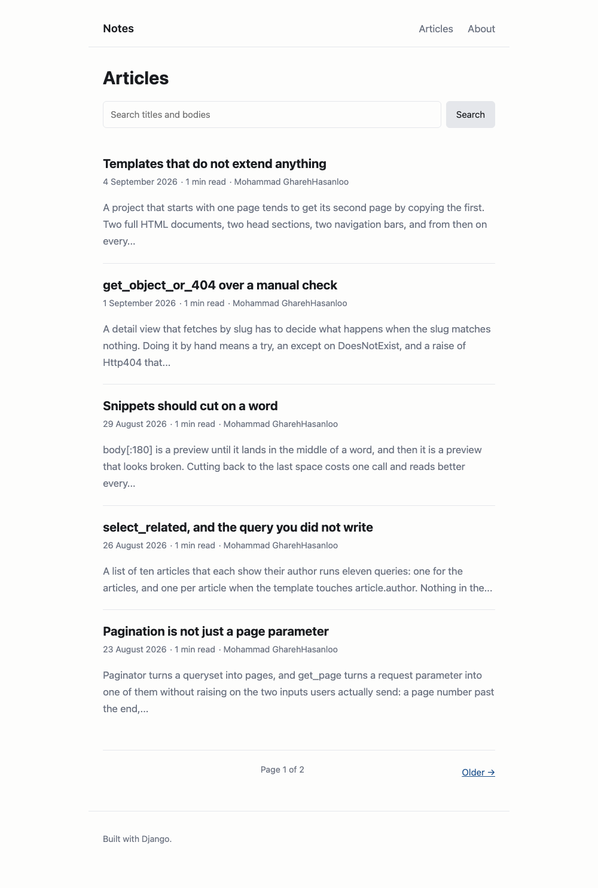
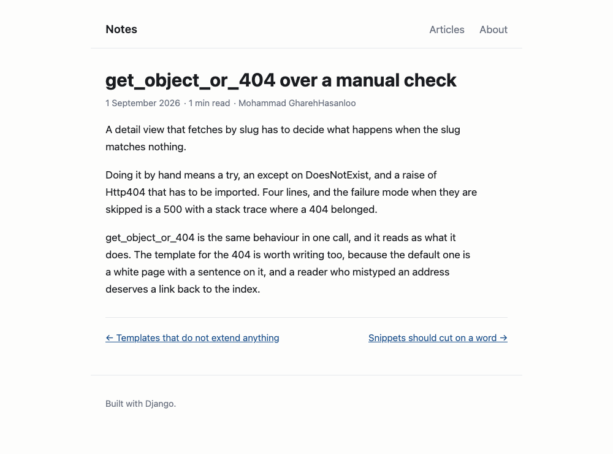
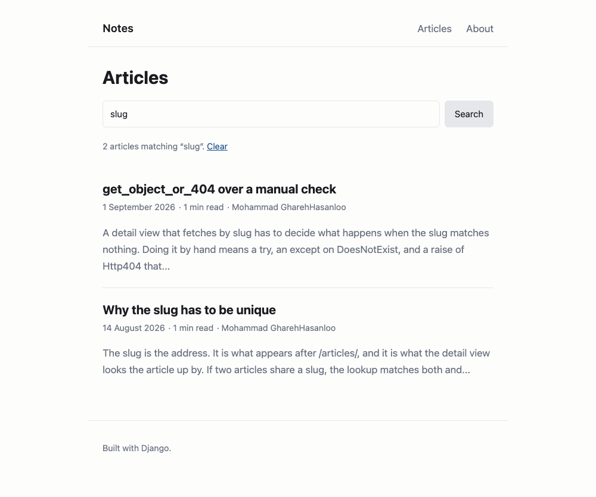
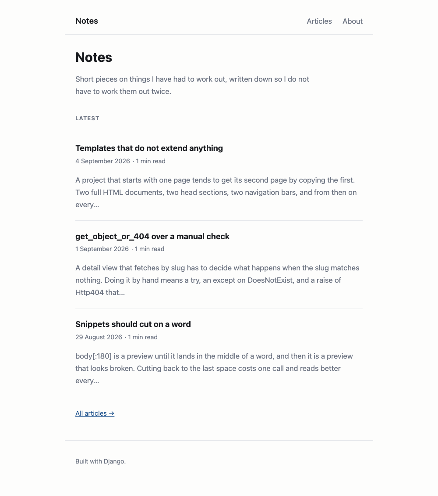
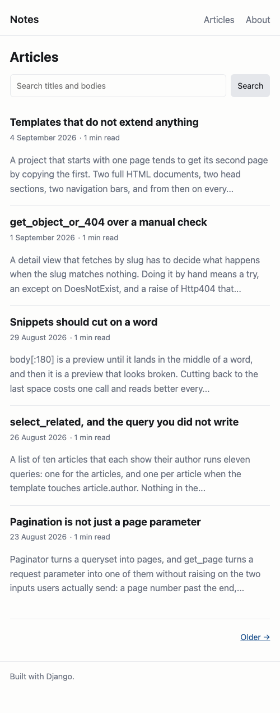

# Notes

A Django blog: articles with a title, slug, body and author, a paginated index
with search, a detail page with links to the articles either side of it in time,
and the Django admin for writing.



## Running it

```bash
pip install -r requirements.txt
python manage.py migrate
python manage.py seed        # eight sample articles, so there is something to see
python manage.py runserver
```

`http://127.0.0.1:8000/` is the front page, `/articles/` the index, `/admin/`
the editor. `seed` also creates the author the samples are attributed to; add a
login for yourself with `createsuperuser`.

```bash
python manage.py test        # 23 tests
```

## What it looks like

An article, with the previous and next post beneath it:



Search filters titles and bodies, and the term survives paging:



The front page carries the three most recent:



On a narrow screen the type comes down a step, the gutters come in, and the
byline drops off the index — on a blog with one author it is the item that
pushes every row onto a second line, and it stays on the article itself:



The page also follows the reader's colour scheme. Both come from CSS; there is
no JavaScript in the project.

## The model

```python
class Article(models.Model):
    title     = models.CharField(max_length=100)
    slug      = models.SlugField(unique=True)
    body      = models.TextField()
    published = models.DateTimeField(default=timezone.now)
    author    = models.ForeignKey(User, on_delete=models.CASCADE,
                                  related_name="articles", null=True, blank=True)

    class Meta:
        ordering = ["-published"]
```

**The slug is unique because it is the address.** Two articles sharing one would
make `/articles/<slug>/` a coin toss over which is served, with nothing raised
and nothing logged — the second article simply becomes unreachable. The admin
fills the slug in from the title for the same reason.

**Ordering is on the model, not in the view.** A view that ends with
`order_by("-published")` is correct until somebody writes a second view, and the
second one comes back in whatever order the database found convenient. On a
small table that is usually insertion order, which looks sorted, so it ships.

**`published` has a default rather than `auto_now_add`.** A creation timestamp
that cannot be set is a timestamp that cannot be backdated, which makes seeding
a believable timeline impossible and makes importing existing posts a database
edit.

## The views

| route | |
| --- | --- |
| `/` | the three most recent articles |
| `/articles/` | every article, five to a page, `?q=` to filter |
| `/articles/<slug>/` | one article, with its neighbours in time |
| `/about/` | a static page |

The list uses `select_related("author")`. Without it, a page of five articles
that each name their author runs six queries instead of one — the extra five
come from `article.author` in the template, which looks like an attribute
access and costs a round trip.

Paging uses `Paginator.get_page`, which handles the two things users actually
send: a page number past the end, and a value that is not a number. Both fall
back rather than raising. The template rebuilds the query string on each link,
so a next-page link from a search does not drop the search on the way — there
is a test for exactly that.

`get_object_or_404` handles an unknown slug, and `templates/404.html` extends
the same base as everything else, so a mistyped address still gets the
navigation and a link back to the index.

## Configuration

Everything that differs between machines is read from the environment; the rest
is committed, so a clone runs without a setup step.

| variable | default | |
| --- | --- | --- |
| `DJANGO_SECRET_KEY` | a development-only value | signs sessions and password reset tokens |
| `DJANGO_DEBUG` | `True` | set to `False` anywhere reachable from outside |
| `DJANGO_ALLOWED_HOSTS` | empty | comma separated, required once `DEBUG` is off |

The key is read from the environment because `settings.py` is the file
everybody commits. Anyone holding it can forge a session or a password reset
token, and once it is in the history it is in every clone — rotating it is the
only fix, and deleting the line is not.

With `DEBUG` off, the HTTPS settings switch on: SSL redirect, HSTS for a year
with subdomains and preload, secure session and CSRF cookies, and
`SECURE_PROXY_SSL_HEADER` so the redirect sees the scheme the client used
rather than the one the proxy spoke. They are conditional because turning them
on in development redirects `http://localhost` to a port nothing is listening
on and stops the session cookie being sent at all.

```bash
DJANGO_DEBUG=False DJANGO_ALLOWED_HOSTS=example.com \
DJANGO_SECRET_KEY=... python manage.py check --deploy
```

passes with no warnings.

## Tests

23 tests over the model, both list and detail views, the site pages and the
seed command. The ones worth naming:

| test | what it pins |
| --- | --- |
| `test_a_duplicate_slug_is_refused` | the uniqueness constraint is really there |
| `test_a_page_past_the_end_falls_back_to_the_last_one` | a bookmarked `?page=99` does not raise |
| `test_a_page_that_is_not_a_number_falls_back_to_the_first` | nor does `?page=last` |
| `test_search_keeps_its_term_in_the_paging_links` | paging out of a search keeps the search |
| `test_the_ends_of_the_timeline_have_one_neighbour` | the newest and oldest articles do not link into nothing |
| `test_every_page_carries_the_shared_navigation` | every template extends the base, so the nav cannot drift |
| `test_seeding_twice_does_not_duplicate` | `seed` is safe to run again |

## Project structure

```
djangoBlog/
    settings.py                    configuration, read from the environment
    urls.py, views.py              the front page and the about page
articles/
    models.py                      the Article model
    views.py                       list with search and paging, detail
    urls.py, admin.py
    management/commands/seed.py    the sample articles
    templates/articles/            list and detail
    tests.py
templates/                         base, home, about, 404
assets/styles.css                  the whole of the styling
docs/                              the screenshots above
```

`db.sqlite3` is not committed. It is produced by `migrate`, and a database file
in version control drifts out of step with the migrations that are supposed to
define it.

The seeded bodies are wrapped in `seed.py` so they can be read there, and
unwrapped on the way into the database. The template renders bodies with
`linebreaks`, which turns every newline into a `<br>` — left alone, the
articles would render with the ragged right edge of the Python source instead
of reflowing to the reader's screen.
